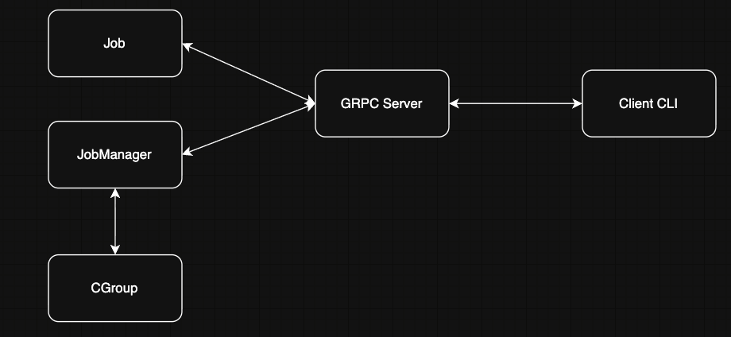
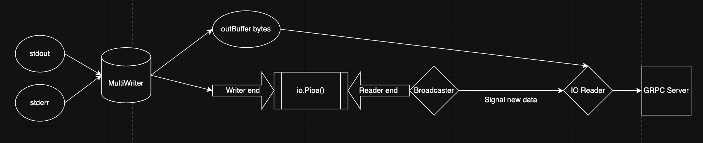

```
# Required Approvers
* Engineering: (@russjones || @zmb3 || @r0mant || @rosstimothy || @nklaassen || @joerger)
```

### What 

This RFD proposes a design for the Level 5 Teleport Systems Engineering Challenge, as described in the [challenge specification](https://github.com/gravitational/careers/blob/main/challenges/systems/challenge-1.md)

### Design 

The solution for this challenge will contain multiple components and I will be explaining the responsibilities and the logic behind each responsibility in the following sections. The components are JobManager, GRPC Server, Cgroup struct, Client CLI and Job struct. Following is a simple flow diagram to show the interactions between the components.




#### Library

##### Job

This struct is responsible for all operations related to a Linux job — starting the process, stopping it, and streaming its output. It represents the core logic of the system and is invoked by both the gRPC server and the Job Manager. Each job has a unique ID and uses Go’s `io.Pipe` to stream output efficiently (producer–consumer style).

###### Start Job
This function will be using `exec` library to start the command with its args. Before starting, it will place the system attributes of the cmd process into its own cgroup. The cgroup will be created by the Job manager for each Job. See [Job Manager](#job-manager), [Cgroups](#cgroups) for more details.

To support streaming, both stdout and stderr are written to two destinations using io.MultiWriter:
1. an in-memory byte buffer (outBuf) for replay, and
2. the writer end of an `io.Pipe`, which enables live streaming to consumers.

###### Streaming a Job

1. Each job maintains a single shared, `outbuf` buffer that stores all process ouput from the moment the job starts. As per above, the stdout and stderr are written to `outbuf` and an `io.Pipe`. Here's the pseudocode snippet:

<pre>
pr, pw := io.Pipe()
j.mainReader, j.mainWriter = pr, pw

// write process output to: 1) in-memory buffer, 2) master pipe
mw := io.MultiWriter(j.outBuf, pw)
cmd.Stdout = mw
cmd.Stderr = mw
</pre>

2. When the job starts, both stdout and stderr of the process are connected to an io.MultiWriter that writes into outBuf and an in-memory io.Pipe. The io.Pipe exists only to detect when new data arrives. The actual bytes are already stored in outBuf.

3. This detection is needed in the `broadcaster` goroutine which I start for every job. The broadcaster goroutine's responsibility is to send a non-blocking signal on a small buffered channel (job.newData).

<pre>
	for {
		n, err := j.mainReader.Read(buf)
		if n > 0 {
			select {
			case j.newData <- struct{}{}:
			default:
			}
		}
</pre>

4. When a client requests for streaming, I will create an instance of an `streamingReader` struct which implements `io.Reader` which looks like this

<pre>
type streamingReader struct {
	job    *Job
	offset int
}
</pre>

5. The `Read()` func of this `streamingReader`  first checks if there is any unread data in outBuf (based on its offset). If so, it copies that data into the provided buffer and advances the offset. If the client has caught up with the `outbuf`, it waits efficiently on the `job.newData` channel until the broadcaster goroutine signals that more data is available.

6. If the job is completed (it gets to know using another channel named `job.Done`) and all data has been consumed, it returns io.EOF.

<pre>
func (r *streamingReader) Read(p []byte) (int, error) {
	for {
    // Send data from outbuf first.
		data := r.job.outBuf.Bytes()
		if r.offset < len(data) {
			n := copy(p, data[r.offset:])
			r.offset += n
			return n, nil
		}

		// checks either for job done or newdata.
		select {
		case <-r.job.done:
			// recheck buffer one last time and then return.
			return 0, io.EOF

		// wait for new data
		case <-r.job.newData:
			continue
		}
	}
}
</pre>

7. When the job finishes (cmd.Wait() returns), the job makes `job.done` as closed and then the broadcaster goroutine exits and the readers as well.

8. In the case of streaming, the API server will deal with the Job directly after getting the Job instance from the Job manager. The API sever would read from the reader in the following manner.

<pre>
reader := job.Stream()
for {
  n, err := reader.Read(buf)
  if n > 0 {
    stream.Send(buf[:n])
  }
  if err == io.EOF {
    break
  }
}
</pre>





###### Stop Job

This function terminates a running job by first canceling its context (which signals the process to exit) and then sending a SIGTERM to the entire process group, ensuring all child processes are also stopped. Creating a process group is like an additional measure to ensure child processes are also stopped in addition cleaning cgroup. See [Cgroups](#cgroups) for more details.  If successful, the job’s status is updated to Stopped; otherwise, any system error (like failure to send the signal) is returned. This will be a synchrounous operation.

###### Status Job

The status of the job will contain the status phrase i.e Running or stopped etc. It will also contain the exit code and error message. The status phrase of the job is changed appropriately at all the places needed.


Note: I think many parts of the codebase especially in Jobs requires using `mutexes` to avoid data races. The entire codebase would also need `context` to make sure goroutines are terminated properly. I cannot envision how I will be using them but I will use them appropriately to avoid data races, deadlocks or goroutines leaks. 

<pre>
const (
  // Pending will be the first status
	JobStatusPending JobStatus = iota
  // Running is when the linux process is running
	JobStatusRunning
  // Stopped is when the client has requested to stop a running process
	JobStatusStopped
  // Exited is when the process exited itself
	JobStatusExited
  // Failed is when the process has failed
	JobStatusFailed
)
</pre>

##### Job Manager

This will be a struct which will be responsible for all the operations that the API server would like to perform. This struct will be a bridge between the API server and job/cgroup structs. I will be maintaining a jobManager per client. The following are the Jobmanager's responsibilities:

1. It maintains one map : A map of job ids and its job structs.
2. When the API server tells the Job manager to start a job, the job manager will take care of creating a unique job id using [uuid](https://github.com/google/uuid) package, creating the cgroup directory for the job and fetching file descriptor of it and invoking the job start function with the `fd`. This will probably be an asynchronous operation.
3. Similary for stopping a job, the Job manager will call the stop function of job and make sure of deleting the cgroup directory for that job. This will be a synchronous function.
4. It is also responsible for returning the Job struct based on ID whenever requested by the API server.


##### Cgroups 

I will be creating a struct CGroups to handle all the operations related to Cgroup. The Cgroup struct will be responsible for ensuring the controllers CPU Memory and Disk IO are enabled. I will be relying on Cgroups v2 only. For a particular job, the cgroup will be `/sys/fs/cgroup/lpaas/<jobid>`. The operations of the cgroups are only called by the Job manager struct and they are:  

1. SetLimits : This function is responsible for setting CPU, Memory, and Disk I/O limits for each Linux job. For Disk I/O throttling, the function targets the physical block device that backs the root filesystem (/). A helper function internally calls the `findmnt` command to determine the device mounted at /. If the device is a partition (e.g. /dev/sda1), the logic automatically detects and maps it to its parent physical device (e.g. /dev/sda), because cgroup v2 I/O controllers only support throttling at the physical device level. I faced errors setting it on partitions.

The following are the limits used and are harcoded for simplicity. 

| Resource         | Controller File | Value                |
|------------------|-----------------|----------------------|
| CPU              | cpu.max         | 50000 100000    (50% of CPU) |
| Memory           | memory.max      | 1,073,741,824 bytes (1 GB)            |
| Disk I/O (R & W)    | io.max            | 8:1 rbps=10,485,760 (10MB/s)  |


2. Placing a Job into its Cgroup : Each Linux job is placed into its own dedicated cgroup under `/sys/fs/cgroup/lpaas/<jobID>` using the `clone3()` system call via Go’s runtime. Before starting the job with `cmd.Start()`, I will be fetching the file descriptor of the cgroup directory and that file descriptor is then assigned to the process’ system attributes

<pre>
cmd.SysProcAttr.CgroupFD = cgroupFD
cmd.SysProcAttr.UseCgroupFD = true
</pre>

3. Delete : This function will send kill signals to all the processes in the `cgroup.procs` file making sure that all processes are killed and at last delete the cgroup directory. This function will be called by the JobManager when the client requests to stop the job.

#### Client

Client will be a CLI which will connect to the GRPC API server. I will be using [Cobra](https://github.com/spf13/cobra) to implement the CLI in Golang. 

The CLI will have the following global flags:

<pre>
Flags:
      --addr string   Server gRPC address (default "localhost:8443")
      --ca string     CA certificate (default "certs/ca.crt")
      --cert string   Client certificate (default "certs/client.crt")
  -h, --help          help for lpaas
      --key string    Client private key (default "certs/client.key")
</pre>

The CLI will have the following sub commands:

##### Start 

<pre>
Start a new linux process job on the lpaas

Usage:
  lpaas start [flags] [--] <command> [args...]

Flags:
  -h, --help   help for start
</pre>

##### Examples 

<pre>
lpaas start -- curl http://www.google.com -O
lpaas start --addr localhost:8443 -- echo teleport
</pre>

##### Stop 

<pre>
Stop a running job on the lpaas

Usage:
  lpaas stop <job-id> [flags]

Flags:
  -h, --help   help for stop
</pre>

##### Examples

<pre>
lpaas stop job-97dd115d-887d-4b8b-b746-59246e8d0ebf
</pre>

##### Stream Logs

<pre>
Log the complete output of a running or completed job of lpaas

Usage:
  lpaas stream-logs <job-id> [flags]

Flags:
  -h, --help   help for stream-logs
</pre>

##### Examples

<pre>
lpaas stream-logs job-97dd115d-887d-4b8b-b746-59246e8d0ebf
</pre>

##### Status 

<pre>
Get the current status of a linux job process of lpaas

Usage:
  lpaas status <job-id> [flags]

Flags:
  -h, --help   help for status
</pre>

##### Examples

<pre>
lpaas status job-97dd115d-887d-4b8b-b746-59246e8d0ebf
</pre>

#### gRPC API Server


The gRPC API server is responsible to maintining the ownership of the jobmanager per client. It will maintain a map which contains the client and its Job manager. 

##### API

This component will expose a gRPC API server that uses Protocol Buffers for both requests and responses. The API will be versioned with the initial version being v1alpha1.
The .proto file defines the Lpaas service and its RPCs:

<pre>
// Lpaas (Linux Process as a Service)
// Provides a gRPC API for starting, stopping, monitoring,
// and streaming output from Linux processes managed by the server.
syntax = "proto3";

package lpaas.v1alpha1;

option go_package = "github.com/rohitsakala/lpaas/api/gen/lpaas/v1alpha1";

// Lpaas defines the main gRPC API for interacting with the
// lpaas library. Each RPC corresponds to an operation on a job.
service Lpaas {
  // Start a new linux job.
  // Returns the unique ID of the job.
  rpc StartJob(StartJobRequest) returns (StartJobResponse);

  // Stops a running job by its ID.
  // Returns the status of the job.
  rpc StopJob(StopJobRequest) returns (StopJobResponse);

  // Query the status of a job.
  // Returns current status and error details if any.
  rpc GetStatus(StatusJobRequest) returns (StatusJobResponse);

  // Stream output from a running or completed job. 
  rpc StreamOutput(StreamRequest) returns (stream StreamChunk);
}

message StartJobRequest {
  string command = 1;
  repeated string args = 2;
}

message StartJobResponse {
  // Job ID
  string id = 1;
}

message StopJobRequest {
  // Job ID
  string id = 1;
}

message StatusJobRequest {
  // Job ID
  string id = 1;
}

// Response for GetStatus.
message StatusJobResponse {
  // Job ID
  string id = 1;

  // Current status of the job.
  // Values: "Pending", "Running", "Stopped", "Exited", "Failed".
  string status = 2;

  // Exit code of the command.
  optional int32 exit_code = 3;

  // Error message.
  optional string error = 4;
}

// Request message for Streaming Output.
message StreamRequest {
  string id = 1;
}

// The bytes chunk of the stream.
message StreamChunk {
  bytes data = 1;
}

// Empty message for StopJobResponse
message StopJobResponse {}
</pre>

### GO Library API

#### JobManager

A JobManager manages a set of Linux jobs for a single authenticated user. A job manager instance is created per client.

<pre>
type JobManager struct {
    // Create track Linux jobs.
    jobs map[string]*Job
}

func NewJobManager() *JobManager
func (m *JobManager) StartJob(command string, args ...string) (string, error)
func (m *JobManager) StopJob(id string) error
func (m *JobManager) GetJob(id string) (*Job, error)
func (m *JobManager) Status(id string) (JobStatus, int, error)
</pre>

#### Job

A job is responsible for start a linux process and other related activities such as stop, status and streaming.

<pre>
type Job struct {
    ID      string
    Command string
    Args    []string
    outBuf *bytes.Buffer

    mainReader *io.PipeReader
    mainWriter *io.PipeWriter
    consumers []*consumer // Has its own buffered channel
}

func (j *Job) Start(ctx context.Context, cgroupFD int) error
func (j *Job) Stop() error
func (j *Job) Stream() io.ReadCloser
func (j *Job) StatusSnapshot() (JobStatus, int, error)
</pre>

#### Cgroup

A cgroup instance is responsible for create a new cgroup and deleting it when required. 

<pre>
type CGroupV2 struct {
    Path string // e.g. /sys/fs/cgroup/lpaas/<jobID>
}

func NewCGroupV2(jobID string) (*CGroupV2, error)
func (cg *CGroupV2) SetLimits() error
func (cg *CGroupV2) Delete() error
</pre>

Please note this is a rough structure and might change a little but essence remains same.


### Authentication

I am planning to use mTLS as authentication and fetching the username from the CN (common name) field of the certificate to authenticate the user.

#### mTLS

1. I plan to use TLS v1.3 for mTLS since it is latest version of TLS. In Go, cipher suites are defaulted for TLS v1.3 in the Go source [here](https://github.com/golang/go/blob/master/src/crypto/tls/defaults.go#L68).

2. To enable mTLS between server and the client, I have used the following field value in the TLS config struct at server side:

<pre> tls.Config{ ClientAuth: tls.RequireAndVerifyClientCert } </pre>

3. The certificates for mTLS (both server and client) must be pre-generated and placed in the certs/ directory. A Makefile will be provided to automatically generate these certificates. For the purpose of this challenge, a single Certificate Authority (CA) will be used, and its certificate will be trusted by both the server and the client. I will use ECDSA P-256 certificates generated via the OpenSSL CLI. I will implement as follows:

<pre> 
# CA cert
make ca-cert

# Server cert,
make server-cert

# Client cert,
make client-cert USER=rohit # CN of the certificate will be rohit.
</pre>

### Authorization

1. The authorization scheme will be very simple. The client who created the job will be the only one to have the control over the job i.e to stop the job, stream logs and query the status of the job. 

2. The Job manager will have the information about the jobs and its owners and it will be stored inside a map data structure. The owner is captured from the certificate in the GRPC component and validation will also be done in this component before invoking any of the functions of Job manager. 


| gRPC Method     | Access Policy                          |
|------------------|----------------------------------------|
| **StartJob**     | Allowed for all authenticated clients |
| **StopJob**      | Only the job owner can stop the job  |
| **GetStatus**    | Only the job owner can query status  |
| **StreamOutput** | Only the job owner can stream logs   |

### Scope Management/Security

In order to maintain simplicity and achieve the goal of smallest possible scope that meets the requirements of the challenge, I have made the following reduction in scope.

1. In the library part of the challenge, the information about the owner and its jobs is stored in-memory inside a map. In a production system, this would be replaced by a persistent RBAC (Role-Based Access Control) layer backed by a secure datastore with audit logging.

2. If time permits, I will be adding logging to the entire codebase. I will be using [log/slog](https://pkg.go.dev/log/slog).

3. For the scope of this challenge, I am assuming the the underlying host has cgroups v2 and the root cgroup has CPU Memory and Disk IO controllers enabled. Hardcoded the limits for now. In a production system, these would be configurable via environment variables or API inputs.

4. For simplicity sake, I am also assuming that the underlying system has much more capability than cgroup hardcoded values. In a production system, these would need to be configurable for each Job.

5. I am combining stdout and stderr into one stream for simplicity and I am not exposing env vars or working dirs, just using command + args as input to the cli for running the linux process. The solution in future should consider what commands can the clients run. Right now, I have not included it in this scope.

6. A production system would also ensure that there is namespacing for the linux jobs for isolation. Also, in a production system, we could implement rate limiting.

7. This solution needs to run as a root since, it mofifies cgroup directories. In future, a this solution must be run using the `Principle of Least Privilege`.

8. We can use Vault/cert-manager to store and auto generate certificates for a production environment. 

### Test Plan

I plan to write unit tests using `testify` and if time permits I will also write integration tests for critical components. Unit tests will mainly concentrate on the error paths and edge cases.

If time permits, I will also implement integration tests to verify end-to-end behavior of few scenarios.
